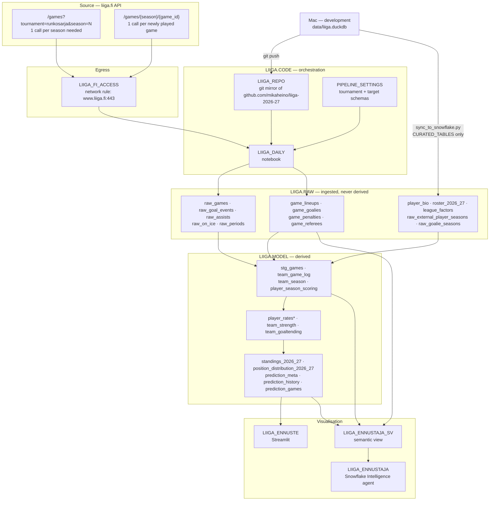

# Snowflake architecture

How the 2026-27 prediction runs in Snowflake, end to end. Companion to
`docs/snowflake_ml_migration.md`, which records *why* each step was taken;
this one records *what is wired to what*.

Account `uqb62234`, database `LIIGA`, warehouse `LIIGA_WH` (X-Small,
auto-suspend 60s).



## Source

Two endpoints, and the call counts are the whole reason ingest is shaped the
way it is.

| Endpoint | Gives | Calls per run |
|---|---|---|
| `/games?tournament=…&season=N` | results, goals, assists, xG, special teams, periods — **the whole season at once** | 1 (target season only; a cold database fetches all six) |
| `/games/{season}/{id}` | lineups, goalies, penalties, referees | 1 per **newly played** game |

Egress goes through `LIIGA_FI_ACCESS`, whose network rule allows exactly
`www.liiga.fi:443`. The account also has a blanket `ALLOW_ALL_INTEGRATION`
(`0.0.0.0:443`) that would have worked; it is deliberately not used.

## Ingest — `LIIGA.RAW`

`liiga.ingest.ingest_all()` handles the season endpoint,
`liiga.results.ingest_results()` the per-game one. Both are incremental and
both merge through `db.replace_rows`.

- **Season tables** are keyed on `season`. `ingest.seasons_to_ingest()` returns
  the target season plus any configured season missing from `raw_games`, so a
  cold database self-heals and a warm one costs one call.
- **Per-game tables** are keyed on `game_id`. `ingest_results` asks the API
  which games ended and the database which it already has, and fetches the
  difference.

Both are idempotent: a re-run replaces its own rows rather than duplicating
them, so a retry after a partial failure is safe.

`data/raw/` — the on-disk JSON cache — exists only on the Mac. Snowflake's
`/tmp` is wiped between runs, which is exactly why the season fetch had to
stop re-reading history.

## Transform — `LIIGA.MODEL`

`liiga.transform.run_transforms()` runs four SQL files from
`src/liiga/sql/` in dependency order:

`stg_games` → `team_game_log` → `team_season` → `player_season_scoring`

This stays a **full rebuild**. Four `CREATE OR REPLACE ... AS SELECT` over
~2900 rows is cheap, and incremental SQL would break the property that makes
this work at all: the same file runs unmodified on DuckDB and Snowflake.

The transforms write and read unqualified table names, so the session needs
both schemas resolvable — see the notebook's `SEARCH_PATH`.

## Model

`liiga.pipeline.forecast()` and `persist()`. Poisson from player rates,
MOV-Elo from results, blended 40/60, 10 000 Monte Carlo seasons, crowd prior
decayed by season progress. Writes five tables, of which `prediction_games` is
the evidence table — per-game probabilities captured *before* kick-off, the
only version worth scoring a played game against.

## Orchestration

`EXECUTE NOTEBOOK LIIGA.CODE.LIIGA_DAILY()` runs three cells:

1. **Bootstrap** — `ALTER GIT REPOSITORY … FETCH`, then pull `src/liiga`,
   `config.yaml` and the curated `data/*.csv|txt` out of the git stage onto
   `/tmp` and put them on `sys.path`. `data/raw` is deliberately not pulled:
   2800 cached per-game JSONs, when six season calls give the same facts.
2. **Context** — read `PIPELINE_SETTINGS` for tournament and target schemas,
   rewrite `config.yaml` to `database.target: snowflake`, then `USE SCHEMA`
   and `ALTER SESSION SET SEARCH_PATH`.
3. **Run** — `refresh_results()` → `build_team_strength()` → `forecast()` →
   `persist()`.

**Nothing is scheduled.** Zero tasks exist in `LIIGA`. A `TASK` calling
`EXECUTE NOTEBOOK` is all that is missing, and it waits until the model has
been checked against real in-season results.

Redeploy after a code change:

```sql
ALTER GIT REPOSITORY LIIGA.CODE.LIIGA_REPO FETCH;
CREATE OR REPLACE NOTEBOOK LIIGA.CODE.LIIGA_DAILY
  FROM '@LIIGA.CODE.LIIGA_REPO/branches/main/snowflake/'
  MAIN_FILE = 'daily_update.ipynb' QUERY_WAREHOUSE = LIIGA_WH;
ALTER NOTEBOOK LIIGA.CODE.LIIGA_DAILY
  SET EXTERNAL_ACCESS_INTEGRATIONS = (LIIGA_FI_ACCESS);
ALTER NOTEBOOK LIIGA.CODE.LIIGA_DAILY ADD LIVE VERSION FROM LAST;
```

`CREATE OR REPLACE` is required: `ADD LIVE VERSION` refuses when one already
exists, so editing in place is not enough. The notebook pulls `src/liiga`
fresh at runtime, so a change to the *package* needs only a git push — only a
change to the *notebook* needs the redeploy above.

## Dev / prod boundary

Two independent models. The Mac is development; Snowflake computes its own
results from liiga.fi. Only the model crosses over:

| Crosses | How |
|---|---|
| Code | git push → `ALTER GIT REPOSITORY … FETCH` |
| Curated inputs the pipeline cannot derive | `scripts/sync_to_snowflake.py`, defaulting to `snowflake_sync.CURATED_TABLES` |

Everything else — `stg_games`, Elo, team strength, standings, simulations —
Snowflake recomputes daily. Pushing local copies over the top would replace
its results with the Mac's, which is the opposite of the intent.
`sync_to_snowflake.py --all` forces a full push for bootstrap or recovery.

## Visualisation

- **`LIIGA.CODE.LIIGA_ENNUSTE`** — Streamlit, reads `LIIGA.MODEL`. One file
  serves both environments by detecting a Snowpark session. **Currently held
  back on purpose** while the local version is developed; do not
  `snow streamlit deploy` without being asked.
- **`LIIGA.MODEL.LIIGA_ENNUSTAJA_SV`** — semantic view over the model tables.
- **`SNOWFLAKE_INTELLIGENCE.AGENTS.LIIGA_ENNUSTAJA`** — agent with one tool,
  `cortex_analyst_text_to_sql`, pointed at that view.

## Portability traps found the hard way

Each of these cost real debugging; none is obvious from the outside.

- **`START` is a reserved word in Snowflake** (`START WITH`) and not in
  DuckDB. `stg_games.sql` failed on `start AS start_ts`. Quoting does not help
  either, because identifier case differs between the backends — the ingest
  emits `start_time` instead.
- **A stored procedure cannot set its schema context.** Both `USE SCHEMA` and
  `ALTER SESSION SET SEARCH_PATH` fail with *Unsupported statement type*. The
  transforms create and read unqualified names, so they need that context.
  This is why the pipeline is a notebook and not a procedure.
- **`SEARCH_PATH` rejects a repeated schema**, so the notebook builds it from
  an ordered set.
- **Snowpark's `session.sql()` rejects `CREATE TABLE x AS SELECT a AS b`**
  with `SnowparkSQLUnexpectedAliasException` — the shape of every transform.
  `db.execute` runs DDL through the underlying cursor instead.
- **Streamlit in Snowflake is an older build**: no `st.column_config`, and
  `width="stretch"` is rejected because `width` is an int there.
  `streamlit_app.full_width()` measures the signature rather than guessing
  from a version number.
- **Column case.** `INFER_SCHEMA` reproduces Parquet names verbatim, so
  lower-case names become quoted, case-sensitive identifiers and unquoted SQL
  stops resolving them. `snowflake_sync` upper-cases on the way out and
  `db.query_df` lower-cases on the way back.
- **DuckDB `HUGEINT`** has no Snowflake equivalent and arrives in pandas as
  float64; counting stats are cast to `BIGINT` on export.
